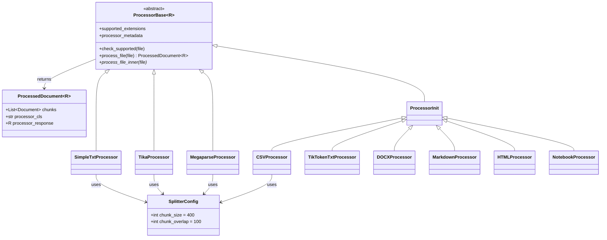
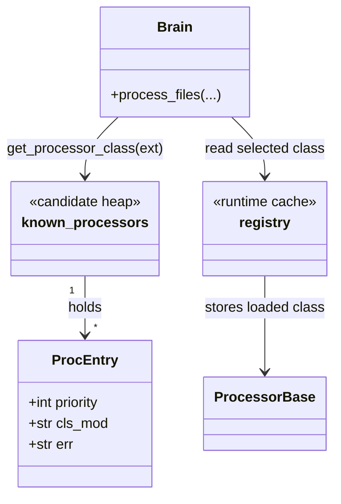
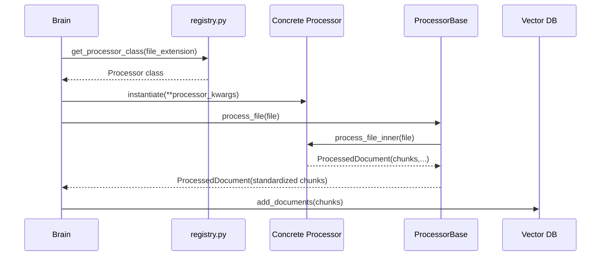

# Quivr `processor` 架构说明

本文聚焦 `core/quivr_core/processor` 目录，说明它在 Quivr 里的职责、目录下各文件与类的功能、类之间的关系，以及它在整个 RAG 系统中承担了哪些关键决策。

## 1. `processor` 在 Quivr RAG 里的角色

`processor` 是 Quivr 文件摄取链路里的“文档标准化层”和“解析路由层”。

它解决的问题很明确：

1. 上游传进来的对象是 `QuivrFile`，本质上只是一个带路径、扩展名、文件元信息的文件句柄。
2. 下游向量库和检索链路不关心 PDF、TXT、DOCX 这些原始格式，它们只接受统一的 `langchain_core.documents.Document`。
3. 不同文件格式需要不同解析方式，系统不能把这些分支判断硬编码进 `Brain`。

所以 `processor` 做了 4 件核心事情：

1. 按文件扩展名选择合适的处理器。
2. 调用具体解析器把原始文件转成文本。
3. 按 chunk 规则切分为多个 `Document`。
4. 为每个 chunk 补齐统一 metadata，交给后续 embedding 和向量库建库流程。

如果没有这一层，`Brain` 就必须同时承担“文件类型识别”“第三方解析器接入”“切块策略”“chunk metadata 规范化”这些职责，顶层抽象会迅速失控。

## 2. 它在主链路里的位置

`processor` 不直接参与问答生成，它只参与 ingestion，也就是“把文件变成可检索知识”的阶段。

主链路可以压缩成下面这条：

```text
用户文件路径
-> load_qfile(...)
-> Storage.upload_file(...)
-> Brain.process_files(...)
-> get_processor_class(file.file_extension)
-> processor.process_file(file)
-> ProcessedDocument(chunks=[Document, ...])
-> vector_db.aadd_documents(...)
-> ask(...)
-> retrieve / generate
```

其中真正把“文件”变成“知识块”的步骤，就是 `processor.process_file(file)`。

## 3. `processor` 目录总览

### 3.1 目录结构

```text
core/quivr_core/processor/
├── __init__.py
├── processor_base.py
├── registry.py
├── splitter.py
└── implementations/
    ├── __init__.py
    ├── default.py
    ├── megaparse_processor.py
    ├── simple_txt_processor.py
    └── tika_processor.py
```

### 3.2 每个文件负责什么

`__init__.py`

- 当前为空文件。
- 作用接近“包声明”，让 `quivr_core.processor` 成为一个可导入包。

`processor_base.py`

- 定义所有处理器共享的抽象基类 `ProcessorBase`。
- 定义统一返回结构 `ProcessedDocument`。
- 负责把具体实现产出的 chunk 做最后一轮清洗和 metadata 标准化。

`registry.py`

- 定义 processor 注册表。
- 维护“文件扩展名 -> 候选处理器”的映射。
- 负责懒加载处理器类，支持优先级和 fallback。

`splitter.py`

- 定义切块配置模型 `SplitterConfig`。
- 给不同 processor 提供统一的 chunk 大小和 overlap 配置。

`implementations/__init__.py`

- 当前为空文件。
- 作用同样是包声明。

`implementations/simple_txt_processor.py`

- 实现最简单的 TXT 文件处理器 `SimpleTxtProcessor`。
- 采用本地读取文本 + 递归字符切块，不依赖外部服务。

`implementations/tika_processor.py`

- 实现 PDF 处理器 `TikaProcessor`。
- 依赖 Apache Tika 服务把 PDF 转成文本，再切块。

`implementations/megaparse_processor.py`

- 实现 `MegaparseProcessor`。
- 把多种文档格式交给 MegaParse 服务解析，再统一切块。

`implementations/default.py`

- 不是写死若干独立类文件，而是通过 `_build_processor(...)` 动态生成一组标准 Processor。
- 这些类本质上都是“LangChain Loader + TextSplitter”的适配层。
- 代表类包括 `CSVProcessor`、`TikTokenTxtProcessor`、`DOCXProcessor`、`MarkdownProcessor`、`HTMLProcessor`、`NotebookProcessor` 等。

## 4. 核心抽象

### 4.1 `ProcessedDocument`

源码位置：[processor_base.py](/Users/wpp/Documents/LiJuanRoot/Codex/20-incubating/quivr-main/core/quivr_core/processor/processor_base.py)

```python
@dataclass
class ProcessedDocument(Generic[R]):
    chunks: List[Document]
    processor_cls: str
    processor_response: R
```

它做了什么：

- 统一封装 processor 的输出结果。
- `chunks` 是真正交给下游向量库的文档块。
- `processor_cls` 记录这批 chunk 由哪个处理器生成。
- `processor_response` 保留底层处理器的原始结果，便于调试和扩展。

为什么这样设计：

- 下游主要关心 `chunks`，但工程上又需要保留“谁生成的”和“底层原始响应”。
- 这让不同处理器可以共享统一接口，同时保留各自实现差异。

按执行顺序会发生什么：

1. 具体 processor 的 `process_file_inner(...)` 先产出 `ProcessedDocument`。
2. `ProcessorBase.process_file(...)` 接手后，对 `chunks` 再做统一清洗。
3. 最终 `Brain.process_files(...)` 只取 `chunks` 进入知识库构建。

### 4.2 `ProcessorBase`

源码位置：[processor_base.py](/Users/wpp/Documents/LiJuanRoot/Codex/20-incubating/quivr-main/core/quivr_core/processor/processor_base.py)

`ProcessorBase` 是所有处理器的统一协议。

它的关键成员有：

- `supported_extensions`
- `check_supported(...)`
- `processor_metadata`
- `process_file(...)`
- `process_file_inner(...)`

#### `supported_extensions`

它做了什么：

- 声明某个处理器支持哪些扩展名。

为什么这样设计：

- 路由层只需要看扩展名，不需要理解内部解析逻辑。
- 新增文件类型时，只要新增一个支持对应扩展的 Processor 并注册即可。

按执行顺序会发生什么：

1. `registry.get_processor_class(...)` 先根据扩展名选中某个类。
2. `ProcessorBase.check_supported(...)` 再做一次运行期保护。

#### `check_supported(...)`

它做了什么：

- 防御性校验，防止处理器被错误地用在不支持的文件上。

为什么这样设计：

- 注册表选路是第一层保护。
- 基类再校验一次，避免手工实例化时绕过注册表造成错误。

#### `processor_metadata`

它做了什么：

- 要求每个具体处理器返回一组可并入 chunk metadata 的处理器级信息。

为什么这样设计：

- chunk 不只需要“内容”，还需要“它是怎么被切出来的”。
- 这些信息对调试、回溯、分析 chunk 质量有价值。

#### `process_file(...)`

这是最关键的模板方法。

它做了什么：

1. 校验扩展名。
2. 调用子类的 `process_file_inner(...)`。
3. 获取当前 `quivr-core` 版本。
4. 清洗每个 chunk 的文本。
5. 统一补充 metadata。

统一补充的 metadata 包括：

- `chunk_index`
- `quivr_core_version`
- `language`
- `file.metadata` 中的文件级信息
- `doc.metadata` 中的 chunk 级信息
- `self.processor_metadata` 中的处理器级信息

为什么这样设计：

- 具体 processor 只关心“怎么解析和切块”。
- 通用清洗和标准化逻辑收敛到基类，避免每个处理器重复实现。

按执行顺序会发生什么：

1. 子类先生成原始 chunks。
2. 基类给每个 chunk 编号。
3. 如果 metadata 中有原始文件名，则把文件名拼进内容头部。
4. 清理空字符并处理 UTF-8 编码问题。
5. 自动识别语言。
6. 合并 metadata，形成统一 chunk 输出。

这一层在整个 RAG 系统里的角色，是“chunk 标准化决策层”。

#### `process_file_inner(...)`

它做了什么：

- 交给子类实现具体解析过程。

为什么这样设计：

- 不同格式文件的解析方式差异很大，必须留给子类自由实现。
- 但输出结构仍然必须统一到 `ProcessedDocument`。

### 4.3 `SplitterConfig`

源码位置：[splitter.py](/Users/wpp/Documents/LiJuanRoot/Codex/20-incubating/quivr-main/core/quivr_core/processor/splitter.py)

```python
class SplitterConfig(BaseModel):
    chunk_size: int = 400
    chunk_overlap: int = 100
```

它做了什么：

- 把切块的两个核心参数标准化为一个配置对象。

为什么这样设计：

- 多个处理器都需要切块参数。
- 用配置对象传递，比散落的两个位置参数更容易复用和扩展。

按执行顺序会发生什么：

1. `Brain.process_files(..., **processor_kwargs)` 可以把配置传给具体 processor。
2. processor 在初始化时读取 `SplitterConfig`。
3. 后续切块器按这个配置执行。

## 5. 注册和路由层

源码位置：[registry.py](/Users/wpp/Documents/LiJuanRoot/Codex/20-incubating/quivr-main/core/quivr_core/processor/registry.py)

这一层回答的是一个核心问题：

“给你一个 `.pdf` 或 `.md` 文件，系统到底该用哪个处理器类？”

### 5.1 `ProcEntry`

```python
@dataclass(order=True)
class ProcEntry:
    priority: int
    cls_mod: str
    err: str | None
```

它做了什么：

- 表示某个扩展名对应的一条候选处理器记录。

字段含义：

- `priority`：优先级，数值越小越优先。
- `cls_mod`：类的导入路径字符串。
- `err`：导入失败时的错误提示。

为什么这样设计：

- Quivr 允许同一种扩展名存在多个候选处理器。
- 例如 `.txt` 既可以用 `SimpleTxtProcessor`，也可以用 `TikTokenTxtProcessor`，还可以尝试 `MegaparseProcessor`。

### 5.2 `base_processors` 与 `known_processors`

它做了什么：

- `base_processors` 定义最基础的扩展名到处理器映射。
- `defaults_to_proc_entries(...)` 再把 `default.py` 里的一批处理器和 `MegaparseProcessor` 追加进去。
- `known_processors` 是最终形成的候选处理器堆。

为什么这样设计：

- 系统需要“默认可用的最小集合”。
- 还需要“有依赖时就优先用更强处理器，没有依赖时自动 fallback”。

### 5.3 `_append_proc_mapping(...)`

它做了什么：

- 向某个扩展名的候选列表追加新处理器，并维护优先级堆。

为什么这样设计：

- 允许插件或默认实现向同一扩展名追加多个处理器。
- 保证后续 `get_processor_class(...)` 能按优先级尝试。

### 5.4 `get_processor_class(...)`

这是注册表里的核心入口。

它做了什么：

1. 先看目标扩展名是否已经在运行期 `registry` 中注册完成。
2. 如果没有，就去 `known_processors` 里拿候选列表。
3. 按优先级逐个尝试 import。
4. 成功后调用 `register_processor(...)` 放入运行期注册表。
5. 如果导入失败，就记录 warning 并尝试下一个候选。
6. 如果一个都没有成功，抛出 `ImportError`。

为什么这样设计：

- 这是“懒加载 + fallback”的典型写法。
- 避免系统启动时强行 import 所有处理器及其依赖。
- 某些可选处理器依赖很重，例如 Tika、Unstructured、MegaParse，没有安装时不应该拖垮整个包导入。

按执行顺序会发生什么：

1. `Brain.process_files(...)` 读取一个文件。
2. 调用 `get_processor_class(file.file_extension)`。
3. 注册表为当前扩展名选出一个当下能 import 的最佳处理器。
4. `Brain` 实例化该类并调用处理。

这一层在 RAG 系统里的角色，是“解析策略选择决策层”。

### 5.5 `register_processor(...)`

它做了什么：

- 支持两种注册方式：
  - 注册类路径字符串，表示把它加入候选池。
  - 注册真实类对象，表示把它放入运行期注册表。

为什么这样设计：

- 字符串注册适合懒加载和插件声明。
- 类对象注册适合运行期 override 和测试替换。

典型用法包括：

- 包初始化时导入 entry points。
- 测试里用自定义 Processor 覆盖默认行为。
- 用户自己扩展新的文件处理器。

这里还要补一层目录外但关系很强的代码：

- [`core/quivr_core/__init__.py`](/Users/wpp/Documents/LiJuanRoot/Codex/20-incubating/quivr-main/core/quivr_core/__init__.py) 在包导入时会执行 `register_entries()`。
- 这个函数会读取 Python entry points 中 `quivr_core.processor` 分组的扩展声明，再调用 `register_processor(...)` 把第三方 processor 加入候选池。

这意味着 Quivr 的 processor 扩展不只支持“改源码新增类”，还支持“通过包插件方式外挂接入”。

### 5.6 `_import_class(...)` 与 `available_processors()`

`_import_class(...)`

- 根据模块路径字符串动态导入类。
- 校验导入结果必须是 `ProcessorBase` 的子类。

`available_processors()`

- 返回 `known_processors` 的键列表，也就是当前“已知有哪些扩展名被 processor 体系识别”。
- 它不是“已成功导入的类对象列表”，更接近“支持的文件类型目录”。

### 5.7 运行期注册表 `registry`

`registry` 是 `_registry` 的只读代理。

它和 `known_processors` 的区别是：

- `known_processors` 记录“理论上可尝试的候选处理器”。
- `registry` 记录“已经成功导入并可直接使用的处理器类”。

这个拆分很重要，因为 Quivr 需要同时支持：

- 默认内置处理器
- 依赖缺失时的降级
- 第三方插件扩展
- 测试期间的 override

## 6. 具体实现类详解

## 6.1 `SimpleTxtProcessor`

源码位置：[simple_txt_processor.py](/Users/wpp/Documents/LiJuanRoot/Codex/20-incubating/quivr-main/core/quivr_core/processor/implementations/simple_txt_processor.py)

### 解决什么问题

它负责最朴素的 `.txt` 处理场景。

适合：

- 本地离线开发
- 不依赖外部解析服务
- 只需要简单按字符切块的纯文本文件

### 类和函数

#### `recursive_character_splitter(...)`

它做了什么：

- 用递归方式把长文本按 `chunk_size` 和 `chunk_overlap` 切成多个 `Document`。

为什么这样设计：

- 不依赖 LangChain splitter，逻辑简单透明。
- 用于最小依赖场景。

按执行顺序会发生什么：

1. 如果文本长度不超过 `chunk_size`，直接返回单 chunk。
2. 否则切出前半块。
3. 从 `chunk_size - chunk_overlap` 的位置继续递归切剩余文本。

#### `SimpleTxtProcessor`

它做了什么：

- 从本地文件异步读取文本。
- 构造单个 `Document`。
- 用递归字符切块器拆成多个 chunk。
- 返回 `ProcessedDocument[str]`，其中 `processor_response` 就是原始全文字符串。

为什么这样设计：

- 这是最轻量的 TXT 实现，不依赖 Tika、Unstructured 或网络服务。

在系统里的角色：

- 作为 `.txt` 的基础保底处理器。
- 在测试、离线调试、最小依赖环境里尤其重要。

## 6.2 `TikaProcessor`

源码位置：[tika_processor.py](/Users/wpp/Documents/LiJuanRoot/Codex/20-incubating/quivr-main/core/quivr_core/processor/implementations/tika_processor.py)

### 解决什么问题

它负责把 PDF 交给 Apache Tika 服务解析为纯文本。

### 关键成员

#### `__init__(...)`

它做了什么：

- 初始化 Tika 服务地址。
- 创建 `httpx.AsyncClient`。
- 初始化 `tiktoken` 编码器。
- 初始化文本切块器。

为什么这样设计：

- PDF 解析通常比 TXT 复杂，交给专业文档解析服务更稳定。
- 切块仍然保留在本地完成，保证 chunk 逻辑一致。

#### `_send_parse_tika(...)`

它做了什么：

- 把文件字节流通过 HTTP PUT 发给 Tika。
- 失败时按 `max_retries` 重试。

为什么这样设计：

- Tika 是外部服务，网络错误和临时失败都需要容错。

#### `processor_metadata`

它做了什么：

- 当前返回 chunk overlap 信息。

这里也暴露出一个实现特点：

- 不同 processor 的 metadata 粒度并不完全一致。
- Quivr 统一了 metadata 合并流程，但没有强制每个处理器暴露同样丰富的字段。

#### `process_file_inner(...)`

它做了什么：

1. 通过 `file.open()` 读取 PDF 字节流。
2. 调用 Tika 解析为文本。
3. 包装成 `Document`。
4. 用 `RecursiveCharacterTextSplitter` 切成多个 chunk。
5. 给每个 chunk 记录 token 级 `chunk_size`。

在系统里的角色：

- 作为 `.pdf` 的基础默认解析器。
- 它代表的是“外部解析服务 + 本地统一切块”路线。

## 6.3 `MegaparseProcessor`

源码位置：[megaparse_processor.py](/Users/wpp/Documents/LiJuanRoot/Codex/20-incubating/quivr-main/core/quivr_core/processor/implementations/megaparse_processor.py)

### 解决什么问题

它试图用一个更强的文档解析服务覆盖多种格式，不只限于 PDF。

支持的扩展名包括：

- `.txt`
- `.pdf`
- `.docx`
- `.doc`
- `.pptx`
- `.xls`
- `.xlsx`
- `.csv`
- `.epub`
- `.bib`
- `.odt`
- `.html`
- `.markdown`
- `.md`
- `.mdx`

### 关键成员

#### `__init__(...)`

它做了什么：

- 初始化 token 编码器。
- 保存 `SplitterConfig` 和 `MegaparseConfig`。
- 初始化本地文本切块器。

#### `process_file_inner(...)`

它做了什么：

1. 通过 `MegaParseNATSClient` 上传文件。
2. 让 MegaParse 服务完成解析。
3. 把响应对象转成字符串。
4. 包成单个 `Document`。
5. 再按统一切块器拆 chunk。
6. 给每个 chunk 写入 token 级 `chunk_size`。

为什么这样设计：

- 解析过程交给专门服务。
- chunk 策略仍掌握在 Quivr 自己手里。

在系统里的角色：

- 它代表“统一多格式解析服务”的路线。
- 从注册策略看，它更像一个高优先级增强候选，而不是绝对保底实现。

## 6.4 `default.py` 动态生成的一组 Processor

源码位置：[default.py](/Users/wpp/Documents/LiJuanRoot/Codex/20-incubating/quivr-main/core/quivr_core/processor/implementations/default.py)

这个文件是整个目录里最值得注意的工程设计点之一。

### `ProcessorInit`

它做了什么：

- 作为动态生成类的基类占位。

为什么这样设计：

- `_build_processor(...)` 最终返回的是 `type(cls_name, (ProcessorInit,), ...)`。
- 这样可以统一生成多个 Processor 类，而不是逐个手写重复代码。

### `_build_processor(...)`

它做了什么：

- 接收类名、LangChain Loader 类、支持的扩展名。
- 动态构造一个新的 Processor 子类。

生成出来的类统一具有这些能力：

1. 保存对应的 Loader 类型。
2. 初始化统一的 `TextSplitter`。
3. 调用 Loader 的 `aload()` 读取文档。
4. 统一切块。
5. 记录 `chunk_size`。
6. 返回 `ProcessedDocument`。

为什么这样设计：

- `CSVProcessor`、`DOCXProcessor`、`MarkdownProcessor`、`HTMLProcessor` 等处理流程高度相似。
- 如果每个都手写一遍，会产生大量模板代码。
- 这里用“动态类工厂”把重复逻辑收敛到了一个函数。

这个设计的代价也很明显：

- 类定义不直观。
- IDE 补全和静态分析体验一般。
- 阅读源码时，要先理解“类是运行时生成的”。

### 动态生成的主要类

文件末尾生成了这些处理器：

- `CSVProcessor`
- `TikTokenTxtProcessor`
- `DOCXProcessor`
- `XLSXProcessor`
- `PPTProcessor`
- `MarkdownProcessor`
- `EpubProcessor`
- `BibTexProcessor`
- `ODTProcessor`
- `HTMLProcessor`
- `PythonProcessor`
- `NotebookProcessor`
- `UnstructuredPDFProcessor`

它们本质上都遵循同一个执行模型：

```text
QuivrFile
-> 对应 LangChain Loader(file_path=...)
-> aload()
-> documents
-> text_splitter.split_documents(...)
-> ProcessedDocument
```

在系统里的角色：

- 这是 Quivr 处理大量常见格式的主力实现层。
- 它体现出 Quivr 一个很务实的选择：优先复用 LangChain 生态的 Loader，而不是为每种格式都自己实现解析器。

## 7. 类之间的关系

### 7.1 类关系 UML



### 7.2 路由关系 UML



### 7.3 调用时序图



## 8. `processor` 目录里的“决策”到底是什么

用户提到“这个 processor 下的功能在这个 RAG 系统中承担了什么决策”，核心可以拆成 5 类。

### 8.1 文件解析策略决策

由 `registry.py` 承担。

问题是：

- `.pdf` 用哪个处理器。
- `.txt` 是用简单本地解析、LangChain Loader，还是 MegaParse。
- 某个候选依赖不可用时如何降级。

这类决策决定了“文件能不能被成功摄取”和“最终拿到的原始文本质量怎么样”。

### 8.2 文本切块策略决策

由 `SplitterConfig` 和各 Processor 的 splitter 初始化承担。

问题是：

- 一个 chunk 多大。
- 相邻 chunk 重叠多少。
- 按字符切，还是按 token-aware splitter 切。

这类决策直接影响：

- embedding 质量
- 检索召回粒度
- 上下文冗余程度
- 生成阶段的上下文利用效率

### 8.3 chunk metadata 标准化决策

由 `ProcessorBase.process_file(...)` 承担。

问题是：

- 每个 chunk 至少要带哪些字段。
- 是否记录语言、chunk 索引、版本号、文件来源。
- 文件级 metadata 和 chunk 级 metadata 如何合并。

这类决策影响后续：

- 调试可观测性
- 检索结果可解释性
- metadata filter 的扩展空间
- 排障效率

### 8.4 容错和降级决策

由 `get_processor_class(...)`、`_send_parse_tika(...)` 和 `Brain.process_files(...)` 共同承担。

问题是：

- 某个处理器导入失败时，要不要 fallback。
- 外部服务短暂失败时，要不要 retry。
- 单个文件处理失败时，是整个 ingestion 失败，还是跳过继续。

这类决策影响系统稳定性和批量导入体验。

### 8.5 扩展边界决策

由 `ProcessorBase` 抽象和 `register_processor(...)` 机制承担。

问题是：

- 新增一种文件格式时，是否需要修改 `Brain`。
- 外部插件是否能注册自己的处理器。
- 测试时是否能覆盖默认解析行为。

Quivr 在这里的选择很明确：

- 把“新增格式”的变化封装在 processor 层。
- 把顶层 `Brain` 保持为稳定门面。

这让 `processor` 成为整个 ingestion 架构里最关键的扩展点。

## 9. `processor` 和上下游模块的边界

### 上游是谁

上游主要是：

- [`load_qfile(...)`](/Users/wpp/Documents/LiJuanRoot/Codex/20-incubating/quivr-main/core/quivr_core/files/file.py)
- Storage 层的 `get_files()`
- [`Brain.process_files(...)`](/Users/wpp/Documents/LiJuanRoot/Codex/20-incubating/quivr-main/core/quivr_core/brain/brain.py)

上游给它的输入是 `QuivrFile`。

### 下游是谁

下游主要是：

- embedding 模块
- vector store
- retrieval 阶段的搜索结果构建

下游拿到的输入是已经标准化的 `Document` chunks。

### 它明确不负责什么

`processor` 不负责：

- 向量化
- 检索召回
- query rewrite
- tool routing
- 最终答案生成

它只负责把原始文件变成“适合被检索”的知识单元。

## 10. 工程评价

从工程取舍看，这套设计有 5 个明显优点。

1. 顶层 `Brain` 很干净，没有被文件解析细节污染。
2. 处理器是可插拔的，新增格式不需要侵入主流程。
3. 懒加载和 fallback 机制对可选依赖很友好。
4. metadata 标准化集中在基类，避免重复。
5. `default.py` 大幅减少了重复模板代码。

同时也有 5 个边界。

1. 不同 processor 输出的 metadata 丰富度不完全一致。
2. `default.py` 的动态类工厂可读性一般。
3. 切块策略目前偏统一，缺少按文件类型定制更细粒度策略。
4. 外部解析服务失败时，错误信息对最终用户不算友好。
5. 这一层主要做“解析 + chunking”，还没有进入更高级的文档结构理解，例如章节层级、表格语义、版面语义。

## 11. 面试表达

如果面试官问你 Quivr 的 `processor` 层是做什么的，可以直接这样说：

“Quivr 的 `processor` 层本质上是 ingestion 阶段的解析和标准化中心。它把上游的 `QuivrFile` 路由到具体处理器，例如 Tika、MegaParse 或 LangChain Loader，然后把不同格式文件统一转成 LangChain `Document` chunks，并在基类里补齐 chunk 索引、语言、版本号和文件来源等 metadata。这样下游 embedding 和向量检索就完全不需要关心原始文件格式。这个设计的关键价值是把文件解析策略、chunk 策略和扩展点从 `Brain` 里解耦出来，让系统可以按扩展名动态选择处理器并支持 fallback。” 
