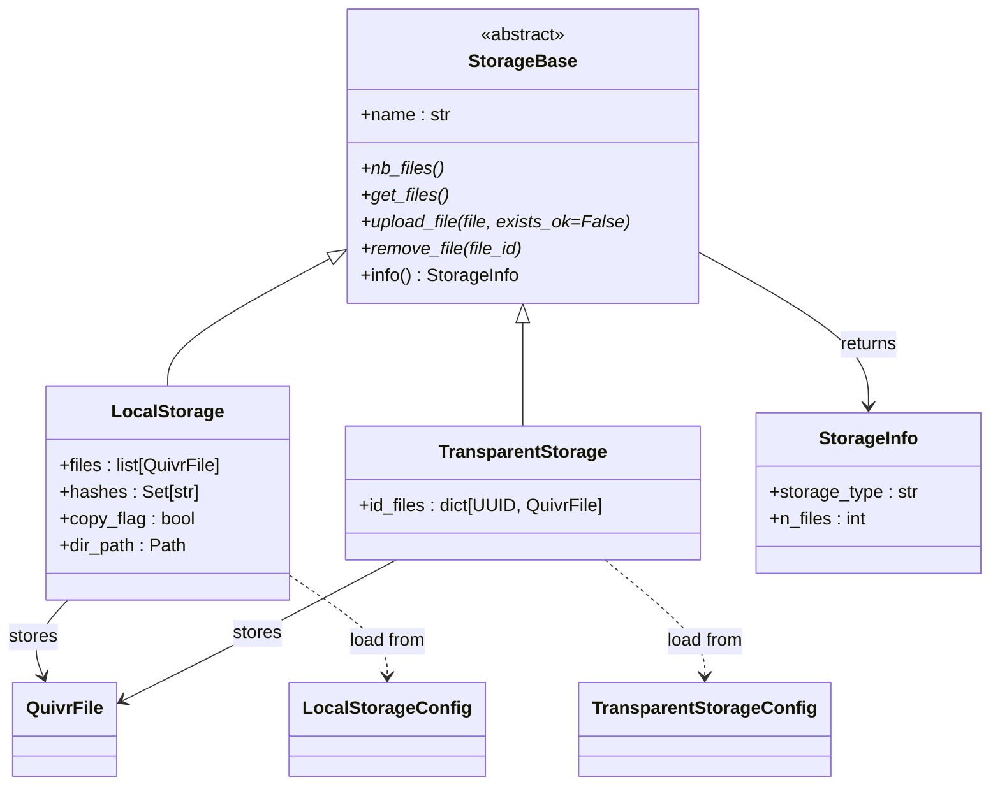
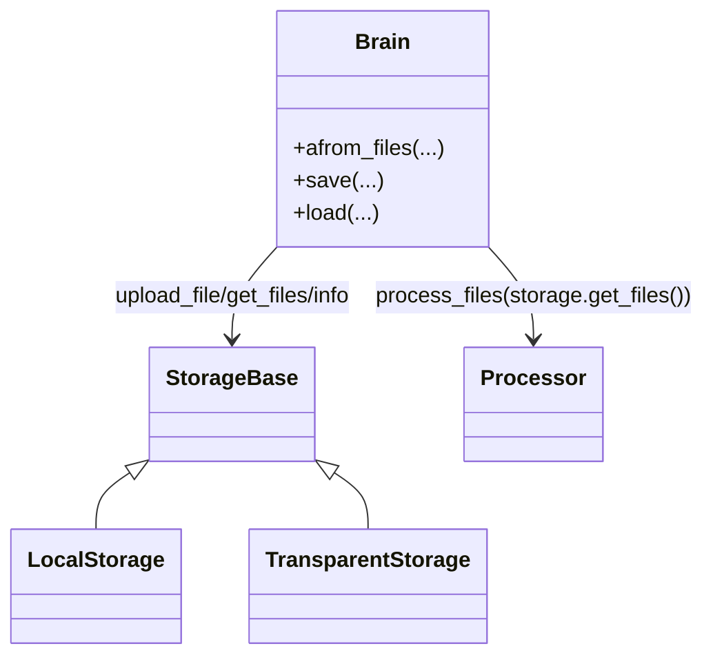
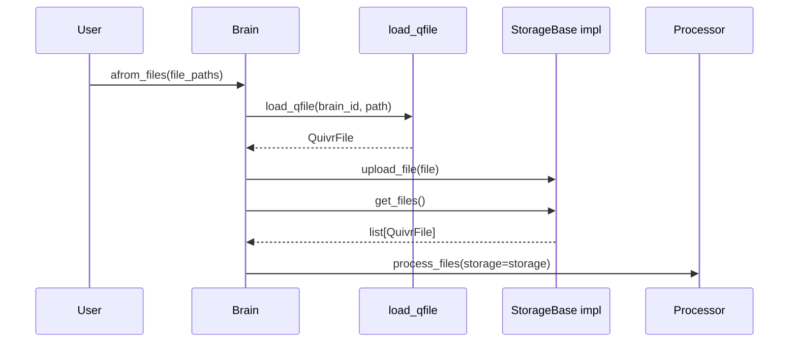

# Quivr `storage` 架构说明

本文聚焦 `core/quivr_core/storage` 目录，说明它在 Quivr 里的职责、目录下各文件与类的功能、类之间的关系，以及它在整个 RAG 系统中承担了哪些关键决策。

## 1. `storage` 在 Quivr RAG 里的角色

`storage` 是 Quivr 文件摄取链路里的“文件登记层”和“文件驻留层”。

它解决的问题很直接：

1. 用户传进来的只是外部文件路径，系统需要把它们纳入自己的管理边界。
2. 后续 `processor` 需要一个统一接口拿到待处理文件，而不想关心这些文件到底存在哪里。
3. `Brain.save()` 和 `Brain.load()` 需要知道文件集合如何恢复。

所以 `storage` 主要做 4 件事：

1. 接收 `QuivrFile`，把文件登记进某种存储实现。
2. 向上层暴露统一的 `get_files()` 读取接口。
3. 维护 storage 级状态，例如文件数量、目录位置、已登记文件集合。
4. 为 `Brain` 的保存和恢复提供 storage 配置与文件清单。

如果没有这一层，`Brain` 就必须同时管理“外部路径”“本地复制或软链接”“内存登记”“恢复配置”这些细节，顶层抽象会变得很重。

## 2. 它在主链路里的位置

`storage` 位于 ingestion 的最前面，先于 `processor`。

主链路可以压缩成下面这条：

```text
用户文件路径
-> load_qfile(...)
-> storage.upload_file(...)
-> storage.get_files()
-> Brain.process_files(...)
-> processor.process_file(...)
-> chunks
-> vector_db.aadd_documents(...)
-> ask(...)
```

这里要抓住一个边界：

- `storage.upload_file(...)` 解决的是“文件怎么纳入系统管理”
- `processor.process_file(...)` 解决的是“文件怎么被解析成知识块”

`storage` 不负责切块，也不负责向量化，它只负责把文件对象管理好，交给后续环节消费。

## 3. `storage` 目录总览

### 3.1 目录结构

```text
core/quivr_core/storage/
├── __init__.py
├── file.py
├── local_storage.py
└── storage_base.py
```

### 3.2 每个文件负责什么

`__init__.py`

- 当前为空文件。
- 作用接近包声明，让 `quivr_core.storage` 成为可导入包。

`storage_base.py`

- 定义所有 storage 实现共享的抽象基类 `StorageBase`。
- 统一规定 `nb_files()`、`get_files()`、`upload_file()`、`remove_file()`、`info()` 这些接口。

`local_storage.py`

- 包含两种真正参与当前主链路的存储实现：
  - `LocalStorage`
  - `TransparentStorage`
- 前者负责把文件真正放到本地目录。
- 后者只做内存登记，不复制文件。

`file.py`

- 定义了一套较旧的 `QuivrFile` / `FileExtension` / `load_qfile(...)` 实现。
- 当前主链路实际使用的是 [`core/quivr_core/files/file.py`](/Users/wpp/Documents/LiJuanRoot/Codex/20-incubating/quivr-main/core/quivr_core/files/file.py)，不是这个文件。
- 这个文件更像历史遗留或兼容层，当前仍有个别旧测试引用它。

## 4. `storage` 在 Quivr 里的主流程

从 [`Brain.afrom_files(...)`](/Users/wpp/Documents/LiJuanRoot/Codex/20-incubating/quivr-main/core/quivr_core/brain/brain.py) 看，`storage` 参与的是建库前半段。

执行顺序是：

1. `load_qfile(brain_id, path)` 把外部路径包装成 `QuivrFile`。
2. `storage.upload_file(file)` 把这个文件交给具体存储实现接管。
3. 文件全部登记完成后，`process_files(storage=storage, ...)` 再通过 `storage.get_files()` 拿回统一文件列表。
4. `processor` 逐个解析这些文件。

在 [`Brain.save(...)`](/Users/wpp/Documents/LiJuanRoot/Codex/20-incubating/quivr-main/core/quivr_core/brain/brain.py) 和 [`Brain.load(...)`](/Users/wpp/Documents/LiJuanRoot/Codex/20-incubating/quivr-main/core/quivr_core/brain/brain.py) 里，`storage` 还负责另一件事：

1. 把当前已登记文件序列化进 `storage_config`。
2. 在下次加载 Brain 时，根据 `storage_type` 恢复为 `LocalStorage` 或 `TransparentStorage`。

所以 `storage` 不只是“上传时用一下”的临时层，它还参与了知识库快照恢复。

## 5. 核心抽象

### 5.1 `StorageBase`

源码位置：[storage_base.py](/Users/wpp/Documents/LiJuanRoot/Codex/20-incubating/quivr-main/core/quivr_core/storage/storage_base.py)

`StorageBase` 是所有存储实现的统一协议。

它的关键成员有：

- `name`
- `__init_subclass__(...)`
- `nb_files()`
- `get_files()`
- `upload_file(...)`
- `remove_file(...)`
- `info()`

#### `name`

它做了什么：

- 要求每个子类声明自己的 storage 类型名。

为什么这样设计：

- `Brain.info()` 需要展示 storage 类型。
- `Brain.save()` / `Brain.load()` 需要根据 storage 类型做序列化和恢复分发。

#### `__init_subclass__(...)`

它做了什么：

- 在子类定义时强制检查 `name` 属性是否存在。

为什么这样设计：

- 把“子类必须声明 storage 类型”的约束前移到类定义阶段。
- 避免有人写了一个 Storage 子类却忘记标明类型名。

按执行顺序会发生什么：

1. 解释器加载某个 `StorageBase` 子类。
2. `__init_subclass__(...)` 自动运行。
3. 如果 `name` 缺失，直接抛 `TypeError`。

#### `nb_files()`

它做了什么：

- 返回当前 storage 里已登记文件的数量。

为什么这样设计：

- 这是最基础的 storage 统计信息。
- `info()` 最终依赖它生成 `StorageInfo`。

#### `get_files()`

它做了什么：

- 返回当前 storage 所管理的 `QuivrFile` 列表。

为什么这样设计：

- `processor` 只需要一组统一的文件对象，不应该知道底层是内存映射还是本地磁盘目录。

这一层在系统里的角色，是“文件读出抽象层”。

#### `upload_file(...)`

它做了什么：

- 把一个 `QuivrFile` 放进当前 storage。

为什么这样设计：

- 文件登记策略应该由 storage 实现决定，而不是由 `Brain` 决定。
- 比如本地存储可以复制文件，透明存储可以只登记引用。

这一层在系统里的角色，是“文件驻留策略决策入口”。

#### `remove_file(...)`

它做了什么：

- 约定 storage 应支持按 `file_id` 删除文件。

当前状态：

- `LocalStorage` 和 `TransparentStorage` 都还没有真正实现删除能力，直接抛 `NotImplementedError`。

这说明当前 `storage` 更偏“建库期登记能力”，不是完整文件生命周期管理系统。

#### `info()`

它做了什么：

- 统一返回 `StorageInfo(storage_type, n_files)`。

为什么这样设计：

- `Brain.info()` 只需要一个稳定结构，不应该关心具体 storage 实现内部状态。

### 5.2 `StorageInfo`

源码位置：[info.py](/Users/wpp/Documents/LiJuanRoot/Codex/20-incubating/quivr-main/core/quivr_core/brain/info.py)

```python
@dataclass
class StorageInfo:
    storage_type: str
    n_files: int
```

它做了什么：

- 表示给展示层使用的 storage 摘要信息。

为什么这样设计：

- `Brain.print_info()` 和 `Brain.__repr__()` 需要统一展示 storage 状态。

它不参与 ingestion 或 retrieval，只服务于可观测性。

## 6. 具体实现类详解

### 6.1 `LocalStorage`

源码位置：[local_storage.py](/Users/wpp/Documents/LiJuanRoot/Codex/20-incubating/quivr-main/core/quivr_core/storage/local_storage.py)

### 解决什么问题

`LocalStorage` 负责把文件真正放到本地目录下，由 Quivr 接管文件落地位置。

适合：

- 希望 Brain 有独立文件缓存目录
- 希望后续 `save/load` 恢复时仍然能指向稳定路径
- 不想依赖原始输入文件继续存在

### 关键状态

- `files: list[QuivrFile]`
- `hashes: Set[str]`
- `copy_flag: bool`
- `dir_path: Path`

这些状态分别表示：

- `files`：当前已登记文件对象列表
- `hashes`：用于去重的 SHA-1 集合
- `copy_flag`：决定复制文件还是建立软链接
- `dir_path`：storage 根目录

### 关键成员

#### `__init__(dir_path=None, copy_flag=True)`

它做了什么：

- 初始化内存中的文件列表和哈希集合。
- 确定本地目录路径。
- 如果没有显式传入目录，就读环境变量 `QUIVR_LOCAL_STORAGE`，否则使用默认路径 `~/.cache/quivr/files`。
- 创建目标目录。

为什么这样设计：

- 让 storage 目录既可以显式配置，也可以有默认兜底。

#### `upload_file(...)`

这是 `LocalStorage` 最关键的方法。

它做了什么：

1. 计算目标路径：`<dir_path>/<brain_id>/<file_id><file_extension>`
2. 用 SHA-1 去重。
3. 根据 `copy_flag` 决定复制原文件还是创建软链接。
4. 把 `file.path` 更新为 storage 内的新路径。
5. 把文件对象加入 `self.files`。
6. 把文件哈希加入 `self.hashes`。

为什么这样设计：

- 复制模式让 Brain 对原始输入路径更独立。
- 软链接模式减少磁盘占用。
- 把 `file.path` 改写成 storage 内路径后，下游 processor 看到的是 Quivr 接管后的路径，而不是原始用户路径。

按执行顺序会发生什么：

1. 用户传进来的是外部文件路径。
2. `load_qfile(...)` 先把它包装成 `QuivrFile`。
3. `LocalStorage.upload_file(...)` 再把这个文件复制或链接到 storage 根目录。
4. 后续 `processor` 处理的就是 storage 内部路径。

这一点很关键，因为它意味着 `LocalStorage` 真正改变了文件的物理驻留位置。

#### `get_files()`

它做了什么：

- 直接返回内存里的 `self.files`。

为什么这样设计：

- 当前实现不重新扫描磁盘，只依赖 upload 时维护的内存状态。

这也是一个工程边界：

- 如果进程外部直接改动了 storage 目录，当前对象不会自动感知。

#### `info()`

它做了什么：

- 代码意图是：在基类 `info()` 结果之外，再暴露 `directory_path`。

为什么这样设计：

- `LocalStorage` 的核心额外状态就是目录位置，展示时有必要露出来。

这里要注意一个当前实现边界：

- `StorageBase.info()` 返回的是 `StorageInfo` dataclass。
- `LocalStorage.info()` 当前写法是 `{"directory_path": self.dir_path, **super().info()}`。
- 按源码直读，这个返回值形状和基类不一致，而且 `**super().info()` 依赖右侧可映射展开。

更稳妥的理解是：

- 这段代码表达了“LocalStorage 想在通用 storage 摘要之外再补目录信息”的设计意图。
- 但当前实现形式本身不够整齐，阅读时不要把它理解成一个已经完全统一好的返回协议。

#### `load(...)`

它做了什么：

- 根据 `LocalStorageConfig` 重建一个 `LocalStorage` 实例。
- 把配置中的序列化文件逐个反序列化回 `QuivrFile`。

为什么这样设计：

- 让 `Brain.load()` 可以恢复 storage 层状态，而不是只恢复向量库。

这里也有一个当前边界：

- `load(...)` 会恢复 `files`，但没有重建 `hashes` 集合。
- 这意味着恢复后的 `LocalStorage` 在去重状态上，没有完整回放运行期内存状态。

### 6.2 `TransparentStorage`

源码位置：[local_storage.py](/Users/wpp/Documents/LiJuanRoot/Codex/20-incubating/quivr-main/core/quivr_core/storage/local_storage.py)

### 解决什么问题

`TransparentStorage` 提供最轻量的 storage 实现。

它的特点很明确：

- 不复制文件
- 不建本地目录
- 不改写物理路径
- 只在内存中保存 `file.id -> QuivrFile`

这也是 Quivr 在 [`Brain.afrom_files(...)`](/Users/wpp/Documents/LiJuanRoot/Codex/20-incubating/quivr-main/core/quivr_core/brain/brain.py) 里的默认 storage。

### 关键成员

#### `__init__()`

它做了什么：

- 初始化 `id_files` 字典。

#### `upload_file(...)`

它做了什么：

- 直接把 `QuivrFile` 放入 `id_files` 映射。

为什么这样设计：

- 在很多场景下，Quivr 不需要真的把文件搬家，只需要记住它们。
- 这是最省 IO、最省磁盘的实现。

按执行顺序会发生什么：

1. 用户文件路径被包装成 `QuivrFile`。
2. `TransparentStorage.upload_file(...)` 只登记引用。
3. 后续 processor 仍直接访问原始路径。

这说明它改变的是“系统是否接管文件存储”这个决策：

- `TransparentStorage` 的答案是“不接管，只登记”
- `LocalStorage` 的答案是“接管到本地目录”

#### `get_files()`

它做了什么：

- 返回 `id_files` 里的值列表。

#### `load(...)`

它做了什么：

- 根据 `TransparentStorageConfig` 把序列化文件字典恢复回内存映射。

为什么这样设计：

- 即使 storage 本身不复制文件，Brain 快照恢复后仍然需要知道原来登记过哪些文件。

## 7. `storage/file.py` 的位置和边界

源码位置：[file.py](/Users/wpp/Documents/LiJuanRoot/Codex/20-incubating/quivr-main/core/quivr_core/storage/file.py)

这个文件定义了：

- `FileExtension`
- `get_file_extension(...)`
- `load_qfile(...)`
- `QuivrFile`

但当前主链路实际使用的是 [`core/quivr_core/files/file.py`](/Users/wpp/Documents/LiJuanRoot/Codex/20-incubating/quivr-main/core/quivr_core/files/file.py)，因为：

- `Brain` 导入的是 `from quivr_core.files.file import load_qfile`
- `LocalStorage` 导入的是 `from quivr_core.files.file import QuivrFile`

所以对于今天的 Quivr 主实现，`storage/file.py` 不是核心入口。

更准确的理解是：

- 它保留了一份较旧、较窄的文件抽象
- 当前只有个别旧测试，例如 [`test_txt_processor.py`](/Users/wpp/Documents/LiJuanRoot/Codex/20-incubating/quivr-main/core/tests/processor/test_txt_processor.py)，还在引用它

这类文件在阅读时要特别小心，避免把“目录里存在”误读为“主链路正在使用”。

## 8. `storage` 和序列化配置的关系

源码位置：[serialization.py](/Users/wpp/Documents/LiJuanRoot/Codex/20-incubating/quivr-main/core/quivr_core/brain/serialization.py)

`storage` 的另一条重要边界，是它和 `BrainSerialized` 的关系。

对应的配置模型有：

```python
class LocalStorageConfig(BaseModel):
    storage_type: Literal["local_storage"]
    storage_path: Path
    files: dict[UUID, QuivrFileSerialized]


class TransparentStorageConfig(BaseModel):
    storage_type: Literal["transparent_storage"]
    files: dict[UUID, QuivrFileSerialized]
```

这说明 `storage` 在系统里承担的不只是运行期文件登记，还包括：

1. 让 `Brain.save()` 知道该保存哪些 storage 状态
2. 让 `Brain.load()` 知道该恢复成哪一种 storage 实现

这也是 `name` / `storage_type` 这种字段必须稳定存在的原因。

## 9. 类之间的关系

### 9.1 类关系 UML



### 9.2 调用关系 UML



### 9.3 调用时序图



## 10. `storage` 目录里的“决策”到底是什么

如果把 `processor` 看成“解析决策层”，那 `storage` 更像“文件驻留与管理边界决策层”。

核心可以拆成 5 类。

### 10.1 文件是否被 Quivr 真正接管

由 `LocalStorage` 和 `TransparentStorage` 的差异承担。

问题是：

- 文件只是登记引用，还是被复制到 Quivr 自己的目录
- 后续处理使用原始路径，还是 storage 内路径

这是 `storage` 最核心的架构决策。

### 10.2 文件去重策略

由 `LocalStorage.upload_file(...)` 里的 SHA-1 哈希判断承担。

问题是：

- 同一个文件是否允许重复上传
- 如果重复上传，系统是否直接报错

当前策略是：

- `LocalStorage` 会基于 `file_sha1` 去重
- `TransparentStorage` 当前没有显式去重逻辑，只按 `file.id` 覆盖映射

这说明不同 storage 实现可以有不同的数据管理语义。

### 10.3 文件路径的生命周期归属

由 `LocalStorage` 的 `file.path` 改写承担。

问题是：

- 下游拿到的路径是用户原路径，还是 Quivr 内部路径

这个决策非常重要，因为它决定了：

- 系统对原始文件路径的依赖程度
- Brain 快照恢复后是否还能稳定访问文件

### 10.4 Brain 恢复时的 storage 恢复策略

由 `LocalStorageConfig`、`TransparentStorageConfig`、`LocalStorage.load(...)`、`TransparentStorage.load(...)` 共同承担。

问题是：

- Brain 从磁盘恢复时，应该重建哪一种 storage
- 文件元信息如何恢复

这类决策影响知识库快照是否可重建。

### 10.5 storage 对外暴露多少实现细节

由 `StorageBase.info()` 和各子类重写 `info()` 的方式承担。

问题是：

- 上层只看到 `storage_type` 和 `n_files`
- 还是还能看到目录路径等具体实现信息

Quivr 当前的选择是：

- 通用层只暴露最小通用信息
- `LocalStorage` 可额外补充目录路径

## 11. `storage` 和上下游模块的边界

### 上游是谁

上游主要是：

- 用户传入的文件路径
- [`load_qfile(...)`](/Users/wpp/Documents/LiJuanRoot/Codex/20-incubating/quivr-main/core/quivr_core/files/file.py)
- [`Brain.afrom_files(...)`](/Users/wpp/Documents/LiJuanRoot/Codex/20-incubating/quivr-main/core/quivr_core/brain/brain.py)

### 下游是谁

下游主要是：

- [`process_files(...)`](/Users/wpp/Documents/LiJuanRoot/Codex/20-incubating/quivr-main/core/quivr_core/brain/brain.py)
- `processor` 层的各类文件解析器
- `Brain.save()` / `Brain.load()` 的 storage 恢复逻辑

### 它明确不负责什么

`storage` 不负责：

- 文本提取
- 文档切块
- 语言识别
- embedding
- 向量检索
- 答案生成

它只负责把文件以某种可管理方式交给系统，并在需要时把这批文件状态恢复出来。

## 12. 工程评价

从工程取舍看，这套设计有 5 个明显优点。

1. `StorageBase` 把文件管理接口稳定住了，`Brain` 不需要理解具体存储细节。
2. `TransparentStorage` 很轻，适合默认使用和快速建库。
3. `LocalStorage` 提供了对文件路径和目录的实际接管能力。
4. storage 和 `Brain.save/load` 打通了，知识库恢复链路完整。
5. storage 和 processor 边界比较清楚，一个管文件驻留，一个管内容解析。

同时也有 5 个边界。

1. `remove_file(...)` 还没有真正实现。
2. `LocalStorage.get_files()` 不会重新扫描磁盘，只信任内存状态。
3. `TransparentStorage` 对原始文件路径仍有较强依赖。
4. `storage/file.py` 和 `files/file.py` 存在抽象重复，容易让读者混淆。
5. 当前 storage 体系只覆盖本地和透明引用，没有对象存储、多租户、权限控制等更完整能力。

## 13. 面试表达

如果面试官问你 Quivr 的 `storage` 层是做什么的，可以直接这样说：

“Quivr 的 `storage` 层本质上是 ingestion 阶段的文件登记和驻留管理层。它先把外部文件路径包装成 `QuivrFile`，再通过 `StorageBase` 抽象把文件交给具体存储实现，例如默认的 `TransparentStorage` 只在内存里登记文件引用，`LocalStorage` 会把文件复制或软链接到 Quivr 自己的目录，并改写后续处理使用的路径。这样 `processor` 层只需要通过 `get_files()` 拿到统一文件对象，不需要关心底层文件怎么保存。与此同时，storage 还参与了 `Brain.save()` 和 `Brain.load()`，负责把文件清单和 storage 类型序列化、恢复出来。” 
